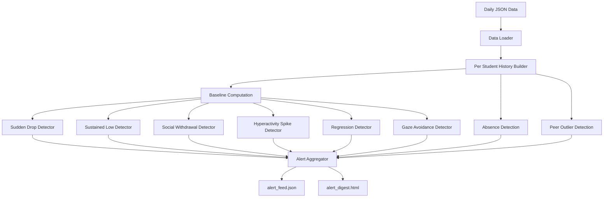

# Sentio Mind — Behavioral Anomaly & Early Distress Detection

This project detects **early signs of distress and behavioral anomalies** in students using historical wellbeing data.

It builds **personal baselines** for each individual and identifies deviations such as sudden drops, sustained distress, social withdrawal, and absence.

---

## Problem Statement

Traditional systems only **visualize scores and trends** but do not proactively alert stakeholders.

> A student may show distress for days before anyone notices.

This project adds an **intelligent alert layer** on top of existing analytics.

---

## 🧩 Solution Overview

The system:
1. Loads daily student data (JSON files)
2. Builds **personal baselines**
3. Detects anomalies using rule-based logic
4. The system is offline-ready and uses no external CDNs for the HTML report.
5. Generates:
   - 📄 `alert_feed.json` (machine-readable)
   - 🌐 `alert_digest.html` (counsellor dashboard)

---

## 🏗️ Architecture


----
## ⚙️ Installation

```bash
pip install numpy
```
### Requirements: Python 3.9+
---
## How to Run

```bash
python solution.py
```
## 📂 Output Files

- `alert_feed.json`
- `alert_digest.html`
---
## 📊 Anomaly Categories

| Category              | Description                                             |
|----------------------|---------------------------------------------------------|
| SUDDEN_DROP          | Wellbeing drops ≥ 20 points from baseline               |
| SUSTAINED_LOW        | Wellbeing < 45 for ≥ 3 days                             |
| SOCIAL_WITHDRAWAL    | Drop in social engagement + downward gaze               |
| HYPERACTIVITY_SPIKE  | Energy increases ≥ 40 points                            |
| REGRESSION           | Recovery followed by sudden drop                        |
| GAZE_AVOIDANCE       | No eye contact for ≥ 3 days                             |
| ABSENCE_FLAG         | Student missing ≥ 2 consecutive days                    |
| PEER_OUTLIER         | Significantly below peer average                        |

---
## 📈 Baseline Logic

- Uses first **3 days** of data  
- Computes:
  - Mean wellbeing  
  - Standard deviation  
  - Trait averages  

### ⚙️ Adaptive Threshold

- If baseline variability is high:
  - `std > 15` → increase detection threshold by **50%**

👉 Prevents false positives
---
## 📄 Output Formats

### 1. `alert_feed.json`

Machine-readable alert structure:

```json
{
  "person_id": "S1",
  "category": "SUSTAINED_LOW",
  "severity": "urgent",
  "description": "Wellbeing stayed below threshold",
  "date": "2026-01-05"
}
```
### 2. `alert_digest.html`

Interactive dashboard with:

- KPI summary  
- Alert table  
- Trend sparklines  
- Highlighted high-risk student  
- Absence tracking
---
## Dashboard Features

- KPI metrics (Total, Flagged, Avg Wellbeing)
- Highlight: Highest risk student
- Sparklines for trend visualization
- Severity-based color coding
- Student-wise anomaly breakdown
- Absence alerts
- Fully offline (no CDN)
---
## Key Design Decisions

- Personalized baselines  
  - Each student is evaluated against their own normal, not global thresholds  

- Multi-signal detection  
  - Combines:
    - Behavioral metrics  
    - Social engagement  
    - Non-verbal cues (gaze, eye contact)  

- Temporal awareness  
  - Uses historical sequences to detect:
    - Trends  
    - Regression  
    - Sustained patterns  

- Alert prioritization  
  - Alerts categorized as:
    - urgent  
    - monitor  
    - informational  

- Offline-first dashboard  
  - No external dependencies  
  - Works without internet
---

## Project Structure
```
.
├── solution.py
├── sample_data/
│ ├── day1.json
│ ├── day2.json
│ └── ...
├── alert_feed.json
├── alert_digest.html
└── README.md
```
---
## Conclusion

This system enables early detection of student distress, helping institutions take timely and proactive action.

From passive analytics → intelligent intervention
---
## Author

**Khusbu Pandey**  
